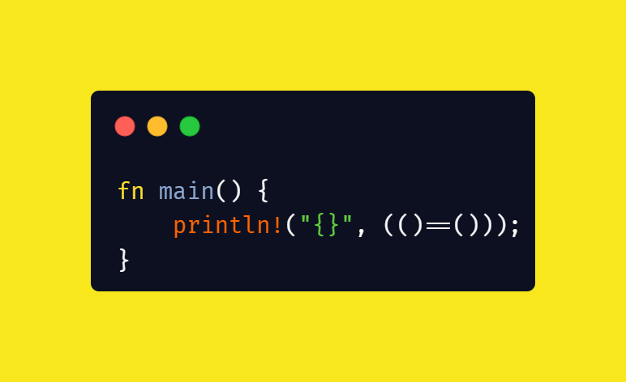

# learning Rust
> A `borrow` at a time

<>

```html
<me>
    <name> Swarnim Arun </name>
    <desg> Rust Engineer @ DeepSource </desg>
</me>
```
---

### > whoami

```scala
-> Swarnim Arun (22yo as of 2023)                    
```
```ruby
-> Rust, Functional & Open Source Evangelist          
```
```ruby
-> System, Graphics, Games & Language Programming    
```
```ruby
-> Rust > Zig > Typescript > CPlusPlus > Swift > Dart
```

```ruby
-> And Bits `Fsharp` & `Haskell`
```
---


# (()==())



---

# what's a borrow?

> `&`

```rust
fn main() {
    let x = 10;
    foo(x); // copy / move
    foo(&x); // borrow - immutable (n-borrow)
    foo(&mut x); // borrow - mutable (1-borrow)
}
```
---

# `deref` & ownership?

> `*`

```rust
trait Deref {
    type Target: ?Sized;
    fn deref(&self) -> &Self::Target;
}
trait DerefMut: Deref {
    fn deref_mut(&mut self) -> &mut Self::Target;
}
```

---

# note the "borrow"

```rust
#[derive(Debug)]
struct Idx(usize);
impl Idx {
    #[must_use]
    fn inc(self) -> Self {
        let Self(idx) = self;
        Self(idx + 1)
    }
}

fn main() {
    let mut id = Idx(0);
    let r = &mut id;
    _ = (*r).inc(); // error!
}
```

---

# the error!

```rust
error[E0507]: cannot move out of `*r` which is behind a mutable reference
  --> src/lib.rs:14:9
   |
14 |     _ = (*r).inc(); // error!
   |         ^^^^ ----- `*r` moved due to this method call
   |         |
   |         move occurs because `*r` has type `Idx`, which does not implement the `Copy` trait
   |
note: this function takes ownership of the receiver `self`, which moves `*r`
  --> src/lib.rs:5:12
   |
5  |     fn inc(self) -> Self {
   |            ^^^^
```

---

# the fix!

```rust
#[derive(Debug, Clone, Copy)]
struct Idx(usize);
impl Idx {
    #[must_use]
    fn inc(self) -> Self {
        let Self(idx) = self;
        Self(idx + 1)
    }
}

fn main() {
    let mut id = Idx(0);
    let r = &mut id;
    _ = (*r).inc(); // no error?
}
```

---

# let's try something real!

```rust
// rust + cat = rat!

use anyhow; // make it easy
type MainResult = anyhow::Result<()>;

fn main() -> MainResult {
    let path = std::env::args()
        .nth(1)
        .as_ref()
        .map(String::as_str)
        .unwrap_or(""); // args[1]
    let src = std::fs::read_to_string(path)?;
    println!("{src}"); // output
    Ok(())
}
```

---

# why does it "not" compile?

```rust
error[E0716]: temporary value dropped while borrowed
  --> src/main.rs:5:16
   |
5  |       let path = std::env::args()
   |  ________________^
6  | |         .nth(1)
   | |_______________^ creates a temporary value which is freed while still in use
...
9  |           .unwrap_or(""); // args[1]
   |                         - temporary value is freed at the end of this statement
10 |       let src = std::fs::read_to_string(path)?;
   |                                         ---- borrow later used here
   |
help: consider using a `let` binding to create a longer lived value
   |
5  ~     let binding = std::env::args()
6  +         .nth(1);
7  ~     let path = binding
   |
```

---

# makin' it work!

```rust
use anyhow; // make it easy
type MainResult = anyhow::Result<()>;

fn main() -> MainResult {
    let src = std::fs::read_to_string(
        std::env::args()
            .nth(1)
            .as_ref()
            .map(String::as_str)
            .unwrap_or(""),
    )?;
    println!("{src}"); // output
    Ok(())
}
```
---

# isn't it still temporary? how does it work then?

```
> The drop scope of the temporary is usually the end of the enclosing statement.
```

```rust
// that is
let src = std::fs::read_to_string(
    std::env::args()
        .nth(1)
        .as_ref()
        .map(String::as_str)
        .unwrap_or(""),
)?;
// the variables is borked after statement ends,
// but what if the variable was used before the statement end?
// and not accessible outside? (no aliasing outside of statement)
```

---

# makin' it work, again!?

```rust
use anyhow; // make it easy
type MainResult = anyhow::Result<()>;

fn main() -> MainResult {
    let path = std::env::args().nth(1);
    let path = path.as_ref().map(String::as_str).unwrap_or("");
    let src = std::fs::read_to_string(path)?;
    println!("{src}"); // output
    Ok(())
}
```
---


---

# another look

```rust
use anyhow; // make it easy
type MainResult = anyhow::Result<()>;

fn main() -> MainResult {
    let path = std::env::args().nth(1);
    let path = path.as_ref().map(String::as_str).unwrap_or("");
//  ^^^^^^^^^^^^^^^^^^^^^^^^^^^^^^^^^^^^^^^^^^^^^^^^^^^^^^^^^^
//  HOW THE HELL DOES THIS WORK ?????
    let src = std::fs::read_to_string(path)?;
    println!("{src}"); // output
    Ok(())
}
```
---

# The Reason

```
> Shadowing is about name-lookup, and doesn't directly affect lifetimes.
```

---

# more code...

```rust
fn main() {
    let mut flags = vec![];
    let mut flag_key: Option<String> = None;
    for arg in std::env::args() {
        if let Some(k) = flag_key {
            flags.push((k, arg));
        } else {
            if let Some((k, v)) = arg.split_once('=') {
                flags.push((k.to_string(), v.to_string()));
            } else {
                flag_key = Some(arg);
            }
        }
    }
    for (k, v) in flags {
        println!("{k} {v}");
    }
}
```

---

# following the error.

```rust
error[E0382]: use of moved value
  --> src/main.rs:5:21
   |
5  |         if let Some(k) = flag_key {
   |                     ^ value moved here, in previous iteration of loop
...
11 |                 flag_key = Some(arg);
   |                 -------- this reinitialization might get skipped
   |
   = note: move occurs because value has type `String`, which does not implement the `Copy` trait
help: borrow this binding in the pattern to avoid moving the value
   |
5  |         if let Some(ref k) = flag_key {
   |                     +++
```

---

# well, hmm...


```rust
fn main() {
    let mut flags = vec![];
    let mut flag_key: Option<String> = None;
    for arg in std::env::args() {
        if let Some(ref k) = flag_key {
        //          ^^^^^
            flags.push((k, arg));
        } else {
            if let Some((k, v)) = arg.split_once('=') {
                flags.push((k.to_string(), v.to_string()));
            } else {
                flag_key = Some(arg);
            }
        }
    }
    for (k, v) in flags {
        println!("{k} {v}");
    }
}
```

---

# the error hole!

```rust
error[E0308]: mismatched types
 --> src/main.rs:9:29
  |
9 |                 flags.push((k.to_string(), v.to_string()));
  |                             ^^^^^^^^^^^^^
  |                             |
  |                             expected `&String`, found struct `String`
  |                             help: consider borrowing here: `&k.to_string()`
```

---

# we keep digging!

```rust
fn main() {
    let mut flags = vec![];
    let mut flag_key: Option<String> = None;
    for arg in std::env::args() {
        if let Some(ref k) = flag_key {
            flags.push((k, arg));
        } else {
            if let Some((k, v)) = arg.split_once('=') {
                flags.push((&k.to_string(), v.to_string()));
                //          ^^^^^^^^^^^^^^
            } else {
                flag_key = Some(arg);
            }
        }
    }
    for (k, v) in flags {
        println!("{k} {v}");
    }
}
```

---

# down the the error hole!

```rust
error[E0716]: temporary value dropped while borrowed
 --> src/main.rs:9:30
  |
6 |             flags.push((k, arg));
  |             -------------------- borrow later used here
...
9 |                 flags.push((&k.to_string(), v.to_string()));
  |                              ^^^^^^^^^^^^^                 - temporary value is freed at the end of this statement
  |                              |
  |                              creates a temporary value which is freed while still in use
  |
  = note: consider using a `let` binding to create a longer lived value

error[E0506]: cannot assign to `flag_key` because it is borrowed
  --> src/main.rs:11:17
   |
5  |         if let Some(ref k) = flag_key {
   |                     ----- borrow of `flag_key` occurs here
6  |             flags.push((k, arg));
   |             -------------------- borrow later used here
...
11 |                 flag_key = Some(arg);
   |                 ^^^^^^^^ assignment to borrowed `flag_key` occurs here
```

---

# actual fix?

```rust
fn main() {
    let mut flags = vec![];
    let mut flag_key: Option<String> = None;
    for arg in std::env::args() {
        if let Some(k) = flag_key {
            flags.push((k, arg));
            flag_key = None;
        //  ^^^^^^^^^^^^^^^^
        } else {
            if let Some((k, v)) = arg.split_once('=') {
                flags.push((k.to_string(), v.to_string()));
            } else {
                flag_key = Some(arg);
            }
        }
    }
    for (k, v) in flags {
        println!("{k} {v}");
    }
}
```
---

# getting a bit advanced?!

```rust
fn get_str(src: impl AsRef<str>) -> &str {
    src.as_ref()
}
```
---

# back with a error...

```rust
error[E0106]: missing lifetime specifier
 --> src/main.rs:1:37
  |
1 | fn get_str(src: impl AsRef<str>) -> &str {
  |                                     ^ expected named lifetime parameter
  |
  = help: this function's return type contains a borrowed value,
          but there is no value for it to be borrowed from

help: consider using the `'static` lifetime
  |
1 | fn get_str(src: impl AsRef<str>) -> &'static str {
  |                                      +++++++
```
---

# more code, more errors

```rust
fn get_str(src: impl AsRef<str>) -> &'static str {
    src.as_ref()
}
```
```rust
error[E0310]: the parameter type `impl AsRef<str>` may not live long enough
 --> src/main.rs:2:5
  |
2 |     src.as_ref()
  |     ^^^^^^^^^^^^ ...so that the type `impl AsRef<str>` will meet its required lifetime bounds
  |
help: consider adding an explicit lifetime bound...
  |
1 | fn get_str(src: impl AsRef<str> + 'static) -> &'static str {
  |                                 +++++++++

error[E0515]: cannot return reference to function parameter `src`
 --> src/main.rs:2:5
  |
2 |     src.as_ref()
  |     ^^^^^^^^^^^^ returns a reference to data owned by the current function
```
---

# cleaning it up!

```rust
fn get_str(src: impl AsRef<str> + 'static) -> &'static str {
    src.as_ref()
}
```
```rust
error[E0515]: cannot return reference to function parameter `src`
 --> src/main.rs:2:5
  |
2 |     src.as_ref()
  |     ^^^^^^^^^^^^ returns a reference to data owned by the current function
```
---

> # a reference to data owned by a function

```rust
fn get_vec_of_strings() -> Vec<String> {
    ["hello, ", "world! ", "from ", "Jon"]
        .into_iter()
        .map(String::from)
        .collect()
}

fn main() {
    let lines = get_vec_of_strings();
    let characters = lines
        .into_iter()
        .map(|s| s.as_str()) // error: taking a reference doesn't work!
        .flat_map(str::chars);
    for c in characters {
        print!("{c}");
    }
    println!();
}
```
---

# alright let's try a fix!

```rust
fn get_vec_of_strings() -> Vec<String> {
    ["hello, ", "world! ", "from ", "Jon"]
        .into_iter()
        .map(String::from)
        .collect()
}

fn main() {
    let lines = get_vec_of_strings();
    let characters = lines
        .into_iter()
        .flat_map(|s| s.as_str().chars());
        // again can't take a reference out of data owned by function
    for c in characters {
        print!("{c}");
    }
    println!();
}
```
---

# the sad fix :(

```rust
fn get_vec_of_strings() -> Vec<String> {
    ["hello, ", "world! ", "from ", "Jon"]
        .into_iter()
        .map(String::from)
        .collect()
}

fn main() {
    let lines = get_vec_of_strings();
    let characters = lines
        .into_iter()
        .flat_map(|s| s.as_str().chars().collect::<Vec<_>>());
    for c in characters {
        print!("{c}");
    }
    println!();
}
```
---

# a better fix!

```rust
fn get_vec_of_strings() -> Vec<String> {
    ["hello, ", "world! ", "from ", "Jon"]
        .into_iter()
        .map(String::from)
        .collect()
}

fn main() {
    let lines = get_vec_of_strings();
    let characters = lines.iter().flat_map(|s| s.chars());
    for c in characters {
        print!("{c}");
    }
    println!();
}
```
---

# also "yes" for the FP'ers in the crowd!

```rust
fn get_vec_of_strings() -> Vec<String> {
    ["hello, ", "world! ", "from ", "Jon"]
        .into_iter()
        .map(String::from)
        .collect()
}

fn main() {
    let lines = get_vec_of_strings();
    let characters = lines
        .iter()
        .map(String::as_str)
        .flat_map(str::chars); // WORKS!
    for c in characters {
        print!("{c}");
    }
    println!();
}
```

---

# alright now let's take a look at the og issue

```rust
fn get_str(src: impl AsRef<str> + 'static) -> &'static str {
    src.as_ref()
}
```

### what is `AsRef<str>` ?

```rust
pub trait AsRef<T>
where
    T: ?Sized,
{
    fn as_ref(&self) -> &T;
}
```
---
### what is `impl` ?

```rust
fn get_str<T: AsRef<str> + 'static>(src: T) -> &'static str;
// it's not quite accurate but it should work for us 
```

### a reification of the above.
```rust
fn get_str(src: &'static str) -> &'static str;
// works!
```

```rust
// but,
fn get_str(src: String) -> &'static str;
// doesn't quite make sense now does it!
```

> #### Hence we lack a way to make the above work in safe Rust code. 
---

# Key take-aways


1. Lifetimes are nuanced.
    a. The drop scope of the temporary is usually the end of the enclosing statement.
    b. Shadowing is about name-lookup, and doesn't directly affect lifetimes.

<hr/>

2. Move is always better than borrow to enforce resource safety. That is, for any value moving allows for better safety guarantees and flexibility in usage than a borrow.
> Don't fear the `move`.

<hr/>

3. If you don't accept a lifetime in input parameters, then you can't output a lifetime from function without the use of `unsafe`, unless in specific cases of `'static` lifetimes.

---

# `split_at` in Rust

```rust
pub struct Str<'a> {
    data: &'a [u8],
}

impl Str<'_> {
    pub fn get(&self, idx: usize) -> Option<u8> {
        self.data.get(idx).copied()
    }
    pub fn split_at(&self, idx: usize) -> Option<(&[u8], &[u8])> {
        if self.data.len() > idx {
            Some((&self.data[..idx], &self.data[idx..]))
        } else {
            None
        }
    }
}
```
---

# `split_at` in modern C++

```cpp
typedef char u8;
typedef size_t usize;
struct Str {
    span<u8> data;
    auto get(usize idx) -> optional<u8> {
        if (idx < this->data.size()) {
            return {this->data[idx]};
        } else {
            return {};
        }
    }
    auto split_at(usize idx) -> optional<tuple<span<u8>, span<u8>>> {
        if (idx < this->data.size()) {
            return {{
                this->data.subspan(0, idx),
                this->data.subspan(idx),           
            }};
        } else {
            return {};
        }
    }
};
```
---
# `split_at` in Zig

```rs
const Str = struct {
    // null terminated string slice
    data: [:0]const u8,
    pub fn get(self: Str, idx: usize) ?u8 {
        if (self.data.len > idx) {
            return self.data[idx];
        } else {
            return null; // equivalent to None
        }
    }
    pub fn split_at(self: Str, idx: usize) ?struct { []const u8, []const u8 } {
        if (self.data.len > idx) {
            return .{ self.data[0..idx], self.data[idx..] };
        } else {
            return null; // equivalent to None
        }
    }
};
```
---

# `split_at` in go, away!? (sharing the pain!)

```go
type Str struct {
	data []byte
}
type MyError struct {
    err string
}
func (s MyError)Error() string {
    return s.err
}
func (s Str) get(idx int) (byte, error) {
	if idx < len(s.data) { // Y THE F**K is len([]T) an int???????? 
		return s.data[idx], nil
	} else {
		return 0, MyError{err: "invalid index"}
	}
}
func (s Str) splitAt(idx int) ([]byte, []byte, error) {
	if idx < len(s.data) {
		return s.data[0:idx], s.data[idx:], nil
	} else {
		return nil, nil, MyError{err: "invalid index"}
	}
} // alright I am sure this is shit code but have patience or don't :P
```

---

# # Thank You

```html
<ul>

    <a href="https://swarnimarun.com"> @website </a>

    <a href="https://twitter.com/swarnimarun"> @twitter </a>
    <a href="https://github.com/swarnimarun"> @github </a>

    <a href="mailto:mail@swarnimarun.com"> @me </a>

    <!-- also I am starting to stream on weekends on twitch & yt -->
    <!-- about programming oss stuff in rust, zig, c++, ts, or etc. -->
    <a href="https://www.twitch.tv/minraws"> @twitch </a>
    <a href="https://www.youtube.com/@minraws"> @youtube </a>


</ul>
```
